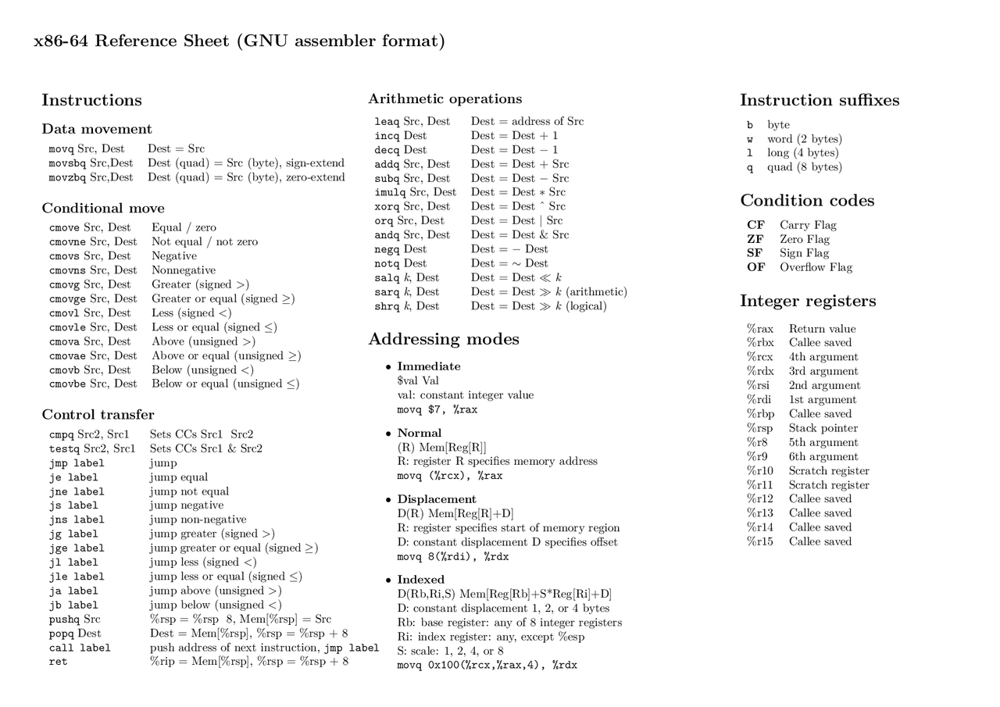

# Hoja de Referencia x86-64 (Formato del ensamblador GNU)

Este repositorio contiene una guía detallada en español de la hoja de referencia x86-64, utilizada en el ensamblador GNU. Esta guía es útil para programadores, entusiastas de la ingeniería inversa, y jugadores de CTF que trabajan con código en bajo nivel.

---

## Tabla de Contenidos

- [Instrucciones](#instrucciones)
  - [Movimiento de Datos](#movimiento-de-datos)
  - [Movimiento Condicional](#movimiento-condicional)
  - [Transferencia de Control](#transferencia-de-control)
- [Operaciones Aritméticas](#operaciones-aritméticas)
- [Modos de Direccionamiento](#modos-de-direccionamiento)
- [Sufijos de Instrucción](#sufijos-de-instrucción)
- [Códigos de Condición](#códigos-de-condición)
- [Registros de Enteros](#registros-de-enteros)

---

## Instrucciones

### Movimiento de Datos

Instrucciones utilizadas para transferir datos entre registros o entre registros y memoria.

- **movq Src, Dest**: Copia el valor de `Src` a `Dest`.
- **movzbq Src, Dest**: Copia `Src` (byte) a `Dest` (quad), con extensión sin signo.
- **movsbq Src, Dest**: Copia `Src` (byte) a `Dest` (quad), con extensión con signo.

Estas instrucciones permiten manipular datos en diferentes ubicaciones, lo cual es esencial en el ensamblador para gestionar variables y valores.

### Movimiento Condicional

Estas instrucciones solo mueven datos si se cumplen ciertas condiciones, basadas en los flags establecidos por operaciones previas.

- **cmove Src, Dest**: Mueve si es igual o cero.
- **cmovne Src, Dest**: Mueve si no es igual o no es cero.
- **cmovs Src, Dest**: Mueve si es negativo.
- **cmovns Src, Dest**: Mueve si no es negativo.
- **cmovg Src, Dest**: Mueve si es mayor (firmado).
  
Estas instrucciones son útiles para realizar decisiones en bajo nivel, permitiendo tomar diferentes rutas de ejecución según ciertas condiciones.

### Transferencia de Control

Estas instrucciones controlan el flujo del programa, permitiendo saltos condicionales o incondicionales a otras partes del código.

- **jmp label**: Salto incondicional a `label`.
- **je label**: Salta si es igual.
- **jne label**: Salta si no es igual.
- **jg label**: Salta si es mayor (firmado).
- **jl label**: Salta si es menor (firmado).

Estas instrucciones permiten controlar la ejecución del programa, algo fundamental en la lógica de bajo nivel y en la programación de ensamblador.

---

## Operaciones Aritméticas

Estas instrucciones permiten realizar operaciones matemáticas entre registros.

- **addq Src, Dest**: `Dest = Dest + Src`.
- **subq Src, Dest**: `Dest = Dest - Src`.
- **imulq Src, Dest**: `Dest = Dest * Src`.
- **xorq Src, Dest**: `Dest = Dest ^ Src`.

---

## Modos de Direccionamiento

Modos que especifican cómo acceder a la memoria en el ensamblador.

- **Inmediato**: `$val` - Valor constante.
- **Normal**: `(R)` - `Mem[Reg[R]]`, usa un registro como dirección de memoria.
- **Desplazamiento**: `D(R)` - `Mem[Reg[R]+D]`, especifica un desplazamiento desde una dirección base.
- **Indexado**: `D(Rb, Ri, S)` - `Mem[Reg[Rb]+S*Reg[Ri]+D]`, modo avanzado con base y escala.

---

## Sufijos de Instrucción

Cada sufijo indica el tamaño de los datos:

- `b`: byte (1 byte)
- `w`: word (2 bytes)
- `l`: long (4 bytes)
- `q`: quad (8 bytes)

---

## Códigos de Condición

Estos flags se establecen en operaciones para representar el resultado:

- **CF**: Flag de Carry (acarreo).
- **ZF**: Flag de Cero.
- **SF**: Flag de Signo.
- **OF**: Flag de Overflow.

---

## Registros de Enteros

Registros de propósito general en x86-64 y su uso común en convenciones de llamada:

- `%rax`: Valor de retorno.
- `%rbx`: Registro guardado (callee saved).
- `%rcx`: 4to argumento.
- `%rdx`: 3er argumento.
- `%rsi`: 2do argumento.
- `%rdi`: 1er argumento.
- `%rsp`: Puntero de pila.
- `%rbp`: Base del marco de la pila.

---

Este repositorio sirve como una referencia rápida para programadores y entusiastas de la ingeniería inversa. ¡No dudes en contribuir si tienes sugerencias!

